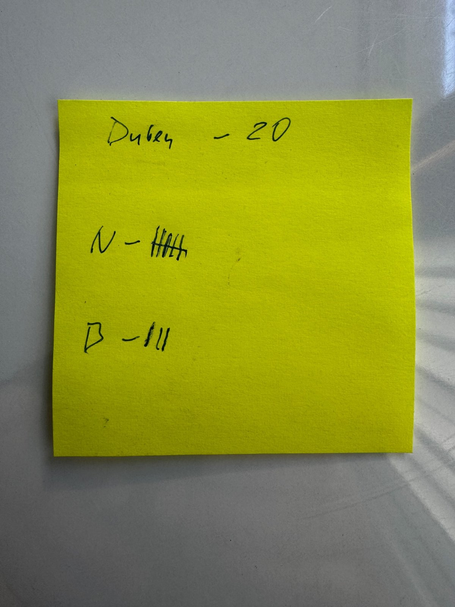
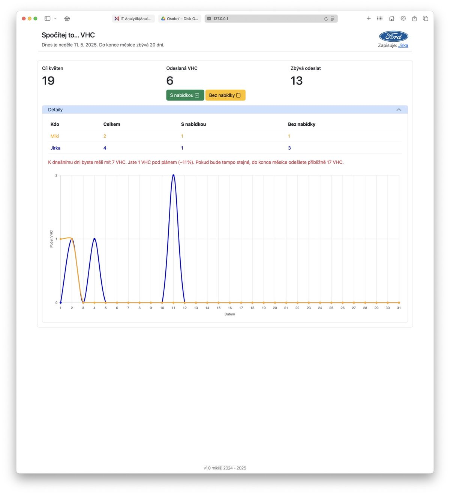

# VHCCount

**VHCCount** je webová aplikace pro sledování počtu odeslaných video kontrol (VHC) během měsíce.  
Umožňuje zaznamenat, zda byla kontrola s nabídkou nebo bez ní, a porovnávat aktuální výkon s měsíčním cílem pomocí tabulky, grafu a výpočtu aktuálního trendu.

---

## ✨ Funkce

- Záznam VHC (s/bez nabídky) jedním kliknutím
- Tabulka s denními záznamy podle uživatele
- Graf denního vývoje s barvami uživatelů
- Výpočet rozdílu oproti plánu a predikce vývoje
- Výstup: „jste pod/nad plánem“, „zbývá XX VHC“ atd.
- Ukládání jména uživatele do localStorage

---

## 🔧 Použité technologie

- HTML, CSS (Bootstrap)
- JavaScript (modulová struktura, bez frameworku)
- Chart.js pro graf
- Google Sheets API přes Google Apps Script
- Architektura **MVC (Model–View–Controller)**

---

## 🚀 Spuštění aplikace

Frontend aplikace je statický (HTML, CSS, JS), ale **komunikuje s externím backendem přes Google Apps Script**, který pracuje s Google Sheets jako úložištěm.

Aplikace je navržena podle architektury **MVC (Model–View–Controller)**, která odděluje logiku, zobrazení a komunikaci s daty.

Z důvodu CORS omezení **je nutné aplikaci spouštět přes lokální server**, například:

- Live Server ve Visual Studio Code
- [CivetWeb](https://github.com/civetweb/civetweb)
- Python: `python3 -m http.server`

Po spuštění otevři `http://localhost:PORT` ve webovém prohlížeči.

---

## 🖥️ Backend

Pro správné fungování je potřeba nasadit backend jako Web App (Google Apps Script).  
Podrobnosti najdeš v [backend/README.md](./backend/README.md)

---

## 🖼️ Ukázky

### Původní systém
Papírový systém používaný dříve pro sledování VHC:

---

### Výsledná aplikace
Digitální verze s přehledem, statistikami a predikcí:

---

Projekt je otevřený pro studijní a demonstrační účely.  
Autor: [Tvé jméno nebo přezdívka]